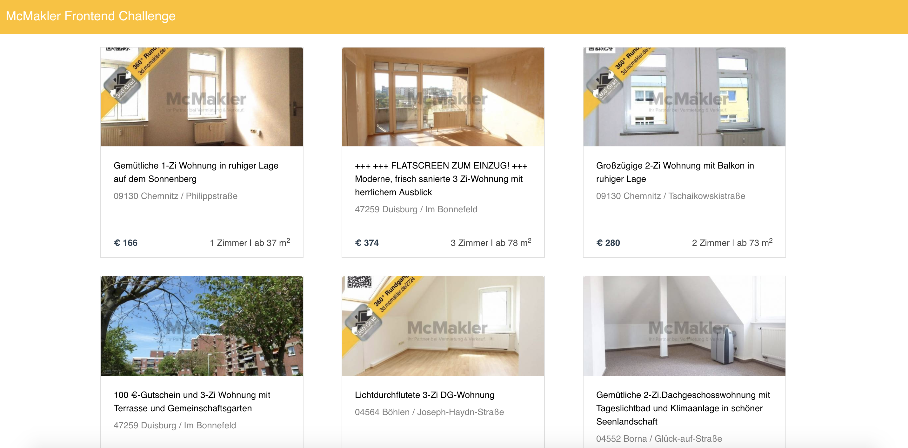

# Front-End Interview Test

> Simple front-end code challenge from McMakler to create pixel perfect UI using chosen tech stack to retrieve advertisement listing.



## Getting Started

``` bash
# install dependencies
npm install

# serve with hot reload at localhost:8080
npm run dev

# build for production with minification
npm run build

# build for production and view the bundle analyzer report
npm run build --report
```

For a detailed explanation on how things work, check out the [guide](http://vuejs-templates.github.io/webpack/) and [docs for vue-loader](http://vuejs.github.io/vue-loader).

For Chrome users, please disable any adblock and/or install Chrome CORS extension: [CORS Toggle](https://chrome.google.com/webstore/detail/cors-toggle/jioikioepegflmdnbocfhgmpmopmjkim?hl=en)

## Built With

* [Vue.js](https://vuejs.org/) - The Progressive JavaScript Framework, Vue.js is a better choice for quick development of cross-platform solutions. It can become a firm basis for high-end single page applications (SPAs) and beneficial solution to those cases, when performance is put ahead of good code organization or app structure.
* [Axios](https://github.com/axios/axios/) - I am using axios to cut the middle step of passing the results of the http request to the .json() method and returns the object data effortlessly.
* [Bootstrap Vue](bootstrap-vue.js.org/docs/) - Bootstrap-Vue provides one of the most comprehensive implementations of Bootstrap V4 components and grid system that I'm sure could be useful for this kind of project in terms of responsive design.
* Built in event bus / publish-subscribe pattern of getting unrelated sections of the application to communicate.

Others: vue-router, vue-moment, etc.

## Personal Notes & Reflection

* Naming convention for objects could be improved through data mapping, but I am not doing that in this test because personally I'm not too familiar with Axios method.
* Not too sure about 'Mieten' and 'Kaufen' part. My guess is whether it is defined in 'purpose', or judging from baseRent or sellPrice.
* Create unit testing for the next time.
